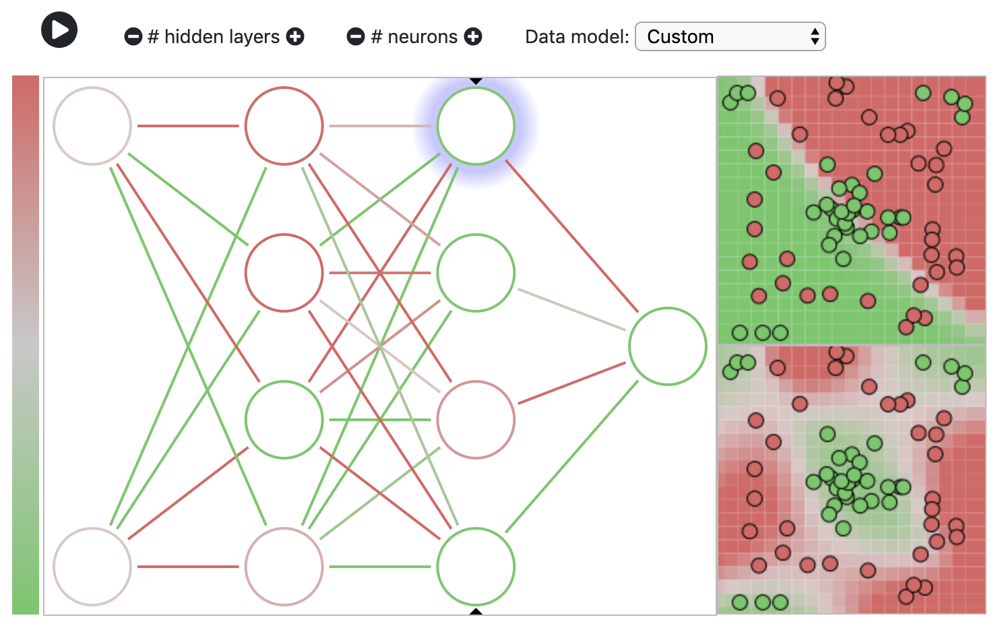

# nnjs
<em>A neural net demo for Javascript</em>



## What is it?

nnjs is a lightweight neural net demo written in Javascript because, well, browsers. It's mostly written as an exercise for myself to learn about building neural nets from scratch, and maybe you can find it useful too. The code focuses on readability and approachability and not on performance -- this ain't trying to be tensorflow!

## Poking around the code

The code herein uses [ES6 syntax](https://developer.mozilla.org/en-US/docs/Web/JavaScript/New_in_JavaScript/ECMAScript_2015_support_in_Mozilla), so if you don't know about [arrow function syntax](https://developer.mozilla.org/en-US/docs/Web/JavaScript/Reference/Functions/Arrow_functions) pause to read about it.

The main entry point is [`main.js`](https://github.com/ozydingo/nnjs/blob/master/main.js). For a top-down approach, start there. For bottom up, check out [`lib/neuron.js`](https://github.com/ozydingo/nnjs/blob/master/lib/neuron.js) and [`lib/neural_network.js`](https://github.com/ozydingo/nnjs/blob/master/lib/neural_network.js), as these classes define the fundamental building blocks used here.

[`lib/neural_network_runner.js`](https://github.com/ozydingo/nnjs/blob/master/lib/neural_networkz-runner.js) drives the training & visualization schedule (timers), and most of the other code has to do with visualizing or modifying the neural network architecture. It was a good excuse to learn to plot things using <svg> and <canvas> elements instead of importing some charting lib such as flot or vis.

## Running the code

To run locally, you need to run a simple web server. This is because the ES6-style `import`s will be blocked by CORS policies if you attempt to open the htmol file directly on your local machine.Luckily, there are many ways to easily run a local web server from a folder, so [check them out](https://threejs.org/docs/#manual/en/introduction/How-to-run-things-locally) and pick your favorite. I'd suggest python or Node.js:

Node.js:

```
# only once per machine
npm install http-server -g

http-server . -p 8000
```

Python 3:

```
python -m http.server
```

Python 2:

```
python -m SimpleHTTPServer
```

## The backlog

 - Better batch training options
 - Validation data, plotted on output graph
 - Model validation, at least as far as a training & test set
 - Activation function selection and visualization
 - Prepared demos of problematic scenarios: learning slowdown, RELU death, etc.
