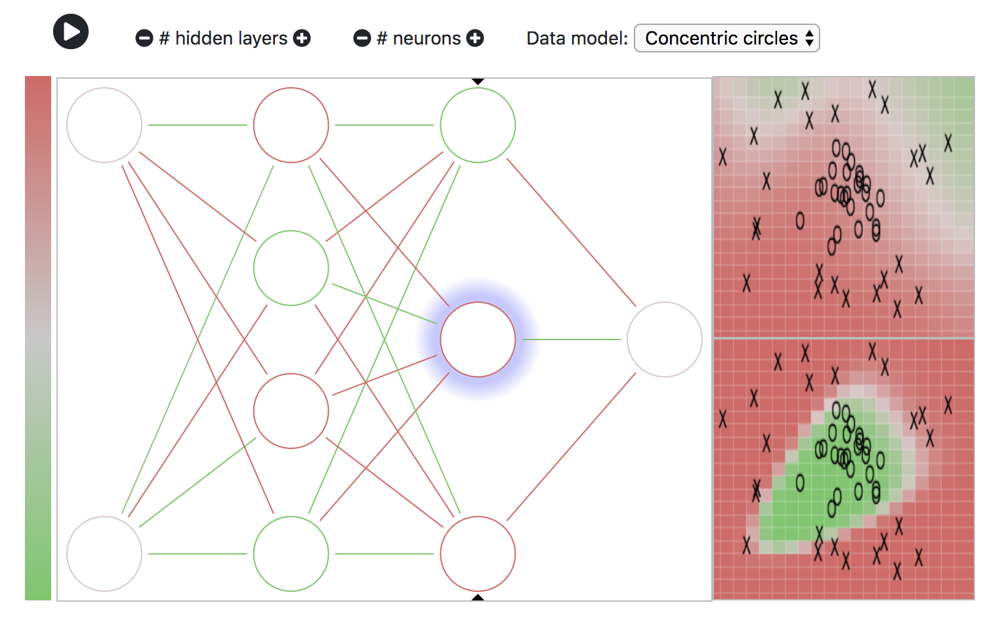

# nnjs
<em>A neural net demo for Javascript</em>

nnjs is a lightweight neural net demo written in Javascript because, well, browsers. It's mostly written as an exercise for myself to learn about building neural nets from scratch, and maybe you can find it useful too. The code focuses on readability and approachability and not on performance (this ain't python or tensoflor.js for that matter!).

If you're poking around, start with [`lib/neuron.js`](https://github.com/ozydingo/nnjs/blob/master/lib/neuron.js) and [`lib/network.js`](https://github.com/ozydingo/nnjs/blob/master/lib/network.js), which define the fundamental building blocks of the learning component. `lib/runner.js` drives the training & visualization schedule (timers), and most of the other code has to do with visualizing or modifying the neural network architecture. It was a good excuse to learn to plot things using <svg> and <canvas> elements instead of importing some charting lib such as flot or vis.

To run locally, you need to run a simple web server. Python is good: use `python -m http.server` for python 3 or `python -m SimpleHTTPServer` for python 2.

On the bucket list:
 - Validation data, plotted on output graph
 - Model validation, at least as far as a training & test set
 - Activation function selection and visualization
 - Prepared demos of problematic scenarios: learning slowdown, RELU death, etc.
